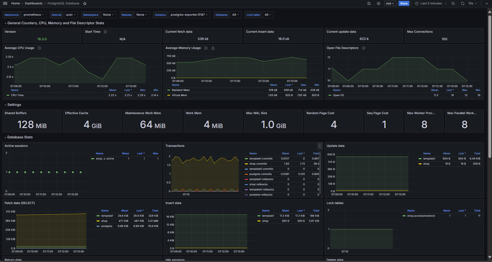

###  **Select Language:** 🌍
- [Español (Spanish)](README-es.md)
- [English](README.md)

# Sistema de Monitoreo con Grafana, Prometheus y PostgreSQL

Este proyecto presenta una configuración básica para un sistema de monitoreo utilizando Grafana, Prometheus, PostgreSQL y un exportador de PostgreSQL. A continuación se detallan los servicios incluidos y cómo ejecutarlos.

## RESULTS
### Monitoring System


## Requisitos Previos

Asegúrate de tener instalado Docker y Docker Compose en tu sistema antes de comenzar.

- Docker: [Cómo instalar Docker](https://docs.docker.com/get-docker/)
- Docker Compose: [Cómo instalar Docker Compose](https://docs.docker.com/compose/install/)

## Configuración del Proyecto

Clona este repositorio en tu máquina local:

```bash
git clone https://github.com/Anyel-ec/Monitoring-BD-Grafana-Prometheus-Postgres
cd Monitoring-BD-Grafana-Prometheus-Postgres
```

## Estructura del Proyecto

El proyecto está configurado con Docker Compose y tiene la siguiente estructura de servicios:

- **grafana**: Panel de visualización y monitoreo.
- **prometheus**: Sistema de monitoreo y alertas.
- **postgres**: Base de datos PostgreSQL para almacenar datos del sistema.
- **postgres-exporter**: Exportador de métricas para PostgreSQL, que permite a Prometheus recolectar métricas de la base de datos.

## Uso del Docker Compose

Para iniciar todos los servicios, ejecuta el siguiente comando en la raíz del proyecto:

```bash
docker-compose up -d
```

Esto levantará todos los contenedores en modo daemon (`-d`), permitiendo que funcionen en segundo plano.

### Acceso a los Servicios

Una vez que los contenedores estén en funcionamiento, puedes acceder a los siguientes servicios desde tu navegador web:

- **Grafana**: [http://localhost:3000](http://localhost:3000)
  - Usuario: admin
  - Contraseña: admin (se especifica en `docker-compose.yml` bajo `GF_SECURITY_ADMIN_PASSWORD`)
  
- **Prometheus**: [http://localhost:9090](http://localhost:9090)

- **Exportador de PostgreSQL**: Las métricas están disponibles en [http://localhost:9187/metrics](http://localhost:9187/metrics)

### Configuración Adicional

- **Persistencia de Datos**:
  - Grafana: Los datos se almacenan en el volumen `grafana_storage`.
  - PostgreSQL: Los datos de la base de datos se almacenan en el directorio `./backup` en tu máquina local.
  
- **Configuración de Prometheus**:
  - El archivo de configuración `prometheus.yml` se monta en el contenedor de Prometheus para especificar los objetivos de scraping. Asegúrate de modificar este archivo según tus necesidades específicas.

## Detener y Limpiar

Para detener y eliminar los contenedores, ejecuta el siguiente comando:

```bash
docker-compose down
```

Esto detendrá los servicios y eliminará los contenedores, pero mantendrá los datos persistentes según la configuración de volúmenes especificada en `docker-compose.yml`.
