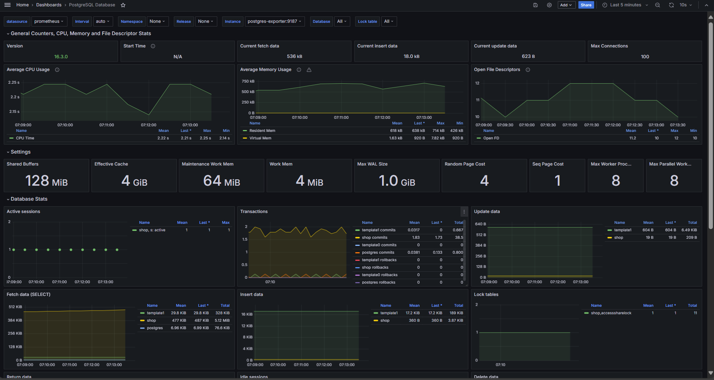

###  **Select Language:** 🌍
- [Español (Spanish)](README-es.md)
- [English](README.md)

# Monitoring System with Grafana, Prometheus, and PostgreSQL

This project provides a basic setup for a monitoring system using Grafana, Prometheus, PostgreSQL, and a PostgreSQL exporter. Below are details about the included services and how to run them.

## RESULTS
### Monitoring System



## Prerequisites

Make sure you have Docker and Docker Compose installed on your system before starting.

- Docker: [Install Docker](https://docs.docker.com/get-docker/)
- Docker Compose: [Install Docker Compose](https://docs.docker.com/compose/install/)

## Project Setup

Clone this repository to your local machine:

```bash
git clone https://github.com/Anyel-ec/Monitoring-BD-Grafana-Prometheus-Postgres
cd Monitoring-BD-Grafana-Prometheus-Postgres
```

## Project Structure

The project is configured using Docker Compose and consists of the following services:

- **grafana**: Visualization and monitoring dashboard.
- **prometheus**: Monitoring and alerting system.
- **postgres**: PostgreSQL database for storing system data.
- **postgres-exporter**: Metrics exporter for PostgreSQL, allowing Prometheus to collect database metrics.

## Using Docker Compose

To start all services, run the following command from the root of the project:

```bash
docker-compose up -d
```

This will launch all containers in daemon mode (`-d`), allowing them to run in the background.

### Accessing Services

Once the containers are up and running, you can access the following services from your web browser:

- **Grafana**: [http://localhost:3000](http://localhost:3000)
  - Username: admin
  - Password: admin (specified in `docker-compose.yml` under `GF_SECURITY_ADMIN_PASSWORD`)
  
- **Prometheus**: [http://localhost:9090](http://localhost:9090)

- **PostgreSQL Exporter**: Metrics are available at [http://localhost:9187/metrics](http://localhost:9187/metrics)

### Additional Configuration

- **Data Persistence**:
  - Grafana: Data is stored in the `grafana_storage` volume.
  - PostgreSQL: Database data is stored in the `./backup` directory on your local machine.
  
- **Prometheus Configuration**:
  - The `prometheus.yml` configuration file is mounted into the Prometheus container to specify scraping targets. Make sure to modify this file according to your specific needs.

## Stopping and Cleaning Up

To stop and remove the containers, run the following command:

```bash
docker-compose down
```

This will stop the services and remove the containers, while keeping persistent data based on the volume configurations specified in `docker-compose.yml`.

---

This README provides an overview of the project and basic guidance for setting up and running it. Make sure to adjust the details according to the specific requirements of your environment and application.